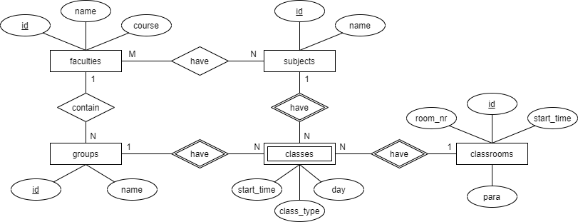
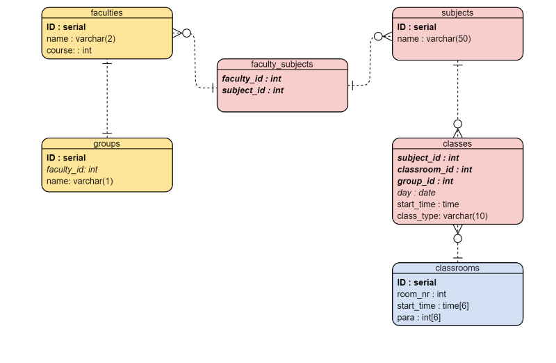

# University Schedule Database  
TASK: Design the database for the University Schedule Problem  

### Author  
Implementer: Yatagani Kleydi - [Kowalsky]  
Email: <famkowalsky@gmail.com>

### Requirements
DBMS: PostgreSQL  

### ER Model - Chen notation:

### ER Diagram:  

